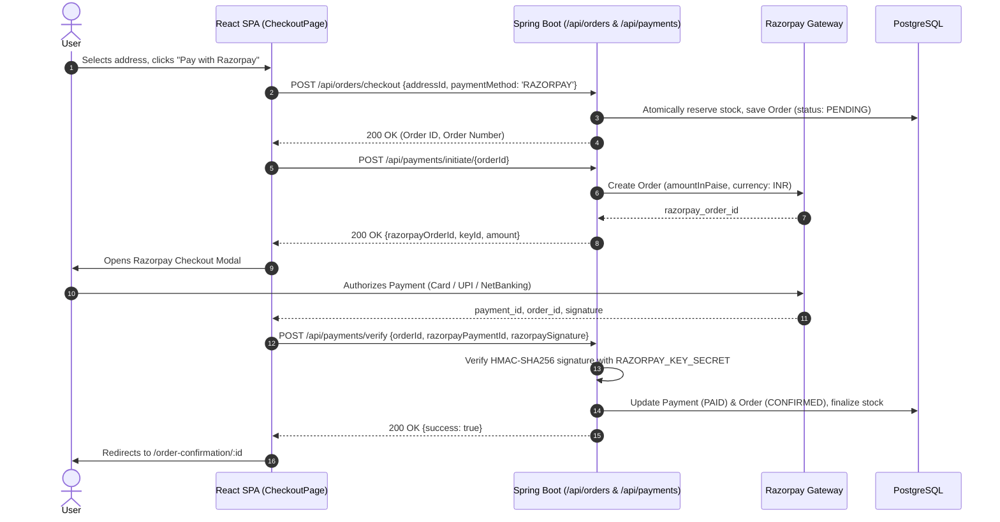

# ShopKart — System Architecture & Design

## 1. Architectural Overview

ShopKart is architected as a **Decoupled Modern E-Commerce Platform** comprising a **React Single-Page Application (SPA)** frontend and a **Spring Boot REST API** backend powered by **Hibernate / Spring Data JPA** and **PostgreSQL**.

```
[ React SPA Client (TypeScript + Vite + Redux) ]
                       │
                       ▼  (HTTP REST over /api/** with credentials: true)
         [ Cross-Origin & Security Layer ]
    (WebMvcConfig CORS + AuthFilter + RoleFilter)
                       │
                       ▼
       [ Spring REST Controllers (@RestController) ]
            (Jakarta Bean Validation DTOs)
                       │
                       ▼
       [ Business Service Layer (@Service) ]
 (Transaction Management, Concurrency Locks, Pricing & Discounts)
                       │
                       ▼
       [ Data Access Layer (Spring Data JPA / DAOs) ]
                       │
                       ▼
          [ HikariCP Connection Pool ]
                       │
                       ▼
         [ PostgreSQL Database (ecommerce_db) ]
```

---

## 2. Layer Responsibilities & Strict Boundaries

| Layer | Technology | Responsibilities | Strict Prohibitions |
|---|---|---|---|
| **Client SPA** | React 19, TypeScript, Vite, Tailwind CSS, Redux Toolkit | Rendering UI views, client routing, user input validation, global UI state (auth, cart, wishlist, notifications). | ❌ Never store private secrets (`RAZORPAY_KEY_SECRET`), no direct DB calls. |
| **REST API Layer** | Spring Boot `@RestController` | HTTP endpoint exposure, JSON serialization, parameter sanitization, Jakarta Bean Validation (`@Valid`). | ❌ No business calculations or direct SQL queries. |
| **Security & Filters** | `AuthFilter`, `RoleFilter`, `WebMvcConfig` | CORS header evaluation, preflight `OPTIONS` handling, role authorization (`ROLE_ADMIN`), structured 401/403 responses. | ❌ No business logic or state modification. |
| **Business Service Layer** | Spring `@Service` POJOs | ACID transaction management (`@Transactional`), authoritative inventory reservation, order placement, Razorpay HMAC-SHA256 signature verification. | ❌ No UI dependencies, no raw HTTP response writing. |
| **Data Access Layer** | Spring Data JPA / JDBC DAOs | Query execution, PostgreSQL connection acquisition via HikariCP, entity mapping. | ❌ No business rule validation. |
| **Database** | PostgreSQL 16+ | ACID transactional state, foreign key integrity, row-level locks on stock movements. | — |

---

## 3. End-to-End Order Placement & Payment Flow


